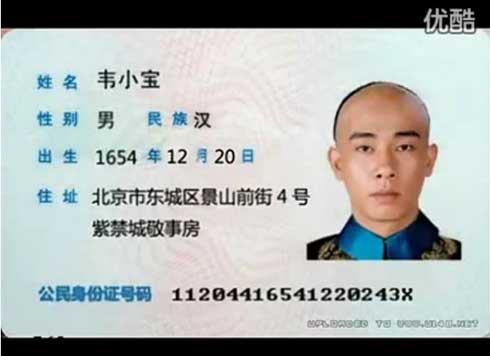

作者[@秀才遇到猫](http://weibo.org/smirklijie)

### 说明  只提供windows测试
+ [loaddll](loaddll) 加载动态库项目
+ [plateocr](plateocr) tesseract 识别和工具函数目录，使用请参考里面函数
+ [opencvdll](opencvdll) plateocr使用mser识别身份证号码图块时所用windows库vc12_x64，使用前请配置path环境变量，打开项目前配置，不然不生效

### plateocr测试使用参见
[plateocr/README.md](plateocr/README.md)

**发现码云不支持表格，还是自己写错了，所以在这里给出不是表格的测试结果**

### 测试结果比较
#### 图片test.jpg-432522199501235621

```
不进行预处理：4271533432522199501235621
后18位：432522199501235621 
进行预处理：311423921432522199501235621
后18位：432522199501235621 
```

#### 图片test1.jpg-11204416541220243X

```
不进行预处理：501142811165112282433
后18位：142811165112282433
进行预处理：2233583353112044165412202438
后18位：112044165412202438
```
